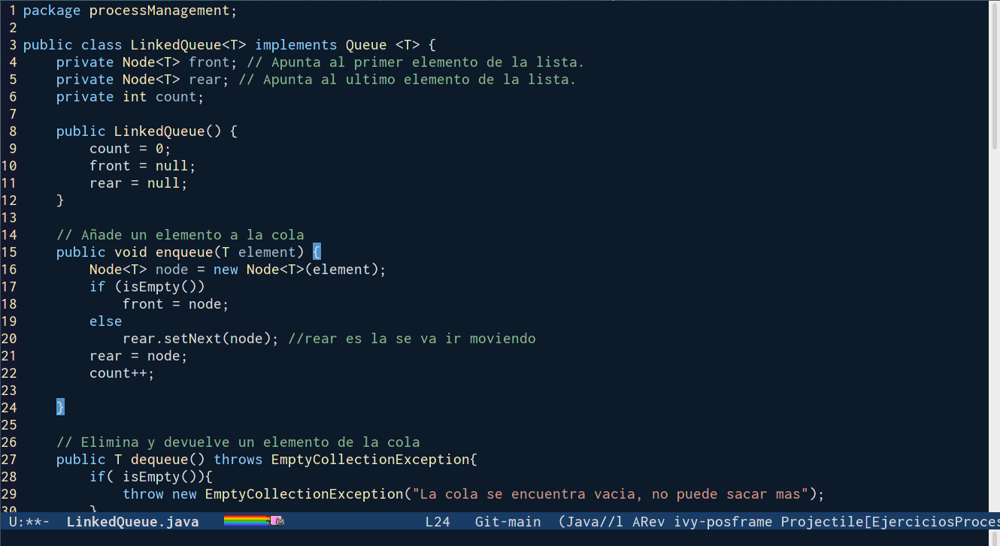
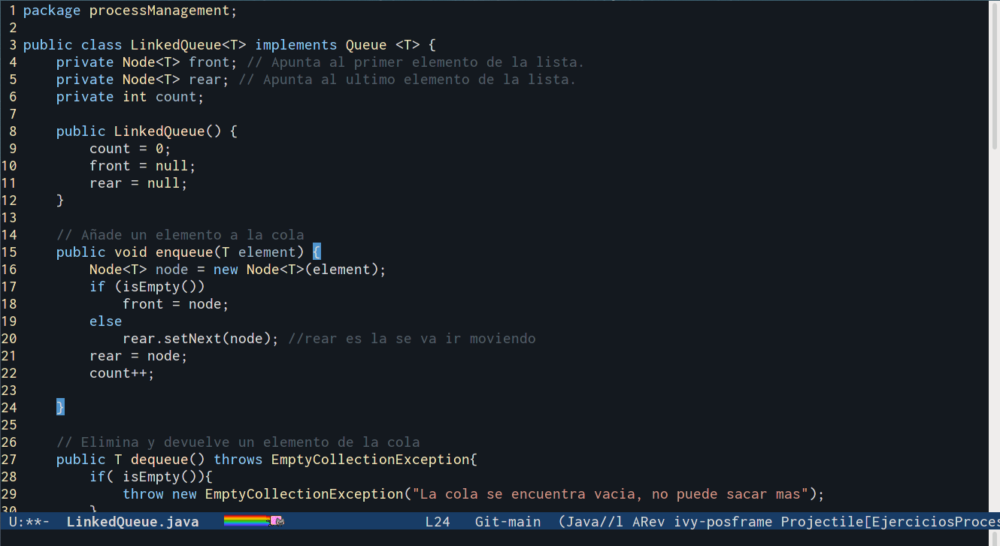

# Dijkstra theme
Es un tema para emacs, el nombre es en honor Cientifico de la Computación [Edsger Wybe Dijkstra](https://en.wikipedia.org/wiki/Edsger_W._Dijkstra).

Entre  sus  contribuciones  a  la  informática están  el  algoritmo  de  caminos  mínimos, también   conocido   como   **“Algoritmo   de Dijkstra”**. Recibió el Premio Turing en 1972.

Era conocido por su baja opinión de la sentencia GOTO en programación, que culminó en 1968 con el artículo Go To Statement Considered Harmful, visto como un paso importante hacia el rechazo de la expresión GOTO y de su eficaz reemplazo por estructuras de control tales como el bucle while. El famoso título del artículo no era obra de Dijkstra, sino de [Niklaus Wirth](https://en.wikipedia.org/wiki/Niklaus_Wirth), entonces redactor de Comunicaciones del ACM. Dijkstra era un aficionado bien conocido de Algol60, y trabajó en el equipo que desarrolló el primer compilador para este lenguaje. En ese mismo año creó el primer sistema operativo con estructura jerárquica, de niveles o capas. Fue denominado THE (Technische Hogeschool, Eindhoven) que se utilizó con fines didácticos. 

## Settings
Clonar el repositorio en tu carpeta de themes y agregar en tu init.el

~~~
(add-to-list 'custom-theme-load-path "~/.emacs.d/initFileEmacs/myThemes/Dijkstra-theme")
(load-theme 'dijkstra t)
;or 
(load-theme 'dijkstra-dark t)

~~~

#### Dijkstra-theme

### Dijkstra-dark-theme

### Referencias 
<https://amturing.acm.org/award_winners/dijkstra_1053701.cfm>

<https://es.wikipedia.org/wiki/Teorema_del_programa_estructurado>

<https://www.ecured.cu/Edsger_Dijkstra>

